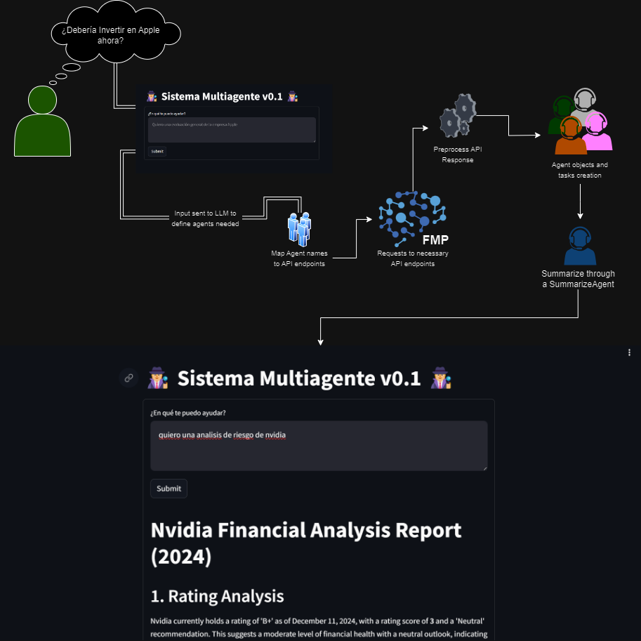

# Multi-Agent Systems

> Github Repo: [aia-lab-mx-finance-multiagent](https://github.com/GenerativeAIHubSPAI/aia-lab-mx-finance-multiagent)

Multi-agent system for comprehensive financial analysis using generative AI. Processes financial information, generates insights, and provides automated risk assessment through specialized AI agents.

## Why use Multi-Agent Systems
Multi-agent systems are powerful approaches to solving complex problems by leveraging the strengths of multiple specialized AI agents. Let me break down the key reasons for using multi-agent systems:

1. Specialization and Expertise
2. Complexity Handling
3. Collaborative Problem Solving
4. Scalability and Flexibility
5. Parallel Processing
6. Redundancy and Reliability
7. Adaptive Learning
8. Real-world Complexity Simulation

**The key is designing agents with clear roles, effective communication protocols, and well-defined interaction mechanisms to maximize their collective potential.**

## Project Workflow




## Directory Tree
```
aia-lab-mx-finance-multiagent
    ├── src
        ├── main.py
        └── process
            ├── agents.py
            ├── api_call.py
            ├── api_response_preprocessing.py
            ├── azure_openai.py
            ├── endpoint.py
            ├── llm_router.py
            ├── logger.py
            ├── multi_agents.py
            ├── prompts.py
            └── utils.py
    ├── README.md
    └── requirements.txt
```

## Next Steps
1. **Features**
    * Improve capabilities: Multiple company comparison
    * Implementation of different information sources.
    * Visual Aids like Charts, Images, etc.
2. **Error Handling**
    * ~~User Errors~~
    * ~~System Errors~~
        * ~~Tech limitations~~
        * ~~Hallucionation Reduction through prompting and algorithms~~
3. **Infrastructure Design & Development**
    * ~~Containerization using Docker~~
    * ~~User Interface Design and Development~~
4. **Logging Filtering & Segmentation**

## Run the Project

<details close>
    <summary>Local Environment</summary>
<br>

1. Open your development environment
2. Using a terminal, run a `git clone <repo_url>`
3. Navigate to the directory repo
```bash
cd <repo>
```
4. Create a `.env` file with the following variables
```python
AZURE_OPENAI_ENDPOINT=""
AZURE_OPENAI_API_KEY=""
AZURE_OPENAI_VERSION=""
MODEL=""

FMP_API_KEY=""
```
5. Create a **Python Virtual Environment**
```bash
python -m venv .venv
```
6. Activate your ***venv***

| Platform | Shell      | Command to activate virtual environment |
| -------- | ---------- | --------------------------------------- |
| POSIX    | bash/zsh   | `$ source <venv>/bin/activate`          |
| POSIX    | fish       | `$ source <venv>/bin/activate.fish`     |
| POSIX    | csh/tcsh   | `$ source <venv>/bin/activate.csh`      |
| POSIX    | pwsh       | `$ <venv>/bin/Activate.ps1`             |
| Windows  | cmd.exe    | `C:\> <venv>\Scripts\activate.bat`      |
| Windows  | PowerShell | `PS C:\> <venv>\Scripts\Activate.ps1`   |

7. Install the required packages
```bash
pip install -r requirements.txt
```
8. Run the following to run the streamlit server and test the app:
```bash
streamlit run --server.port 8501 ./src/main.py
```
9. Open your browser and go to `127.0.0.1:8501` to play around.

</details>

---

<details close>
    <summary>Run using a Docker container in Lightning</summary>
<br>
    
1. Go to the top menu, `Terminal` > `New Terminal`
2. Run a `git clone <repo_url>`
3. `cd <repo>`
4. In the root of the repository create the `.env` file with the environmental variables
```python
AZURE_OPENAI_ENDPOINT=""
AZURE_OPENAI_API_KEY=""
AZURE_OPENAI_VERSION=""
MODEL=""

FMP_API_KEY=""
```
5. In the terminal run `docker build` to create the image that the container is going to use:
```bash
docker build -t <image_name> .
```
6. Once the image is build, click on the streamlit plugin
7. Click on `+ New App`
8. Add the following command instead of the `streamlit command`:
```bash
docker run --name <container_name> -p 8501:8501 <image_name>:<tag>
```
9. Check that the port specified is the `8501`
10. Click on the `Run` button on the right bottom corner

</details>

---

<details close>
    <summary>Run using a Docker container locally</summary>
<br>

> Important Notes: Make sure that you install `Git`, `Docker` and `Python` in your local environment

1. Open your development environment
2. Using a terminal, run a `git clone <repo_url>`
3. Navigate to the directory repo using your terminal
```bash
cd ./route/to/repo
```
4. Create a `.env` file inside the repository folder with the following variables
```python
AZURE_OPENAI_ENDPOINT=""
AZURE_OPENAI_API_KEY=""
AZURE_OPENAI_VERSION=""
MODEL=""

FMP_API_KEY=""
```
5. Using the terminal in the repository route run `docker build` to create the image that the container is going to use:
```bash
docker build -t <image_name>:<tag> .
```
> It's important to know that if you don't add a tag it's going to default to the tag `latest`, for example `nginx:latest`.
6. Run `docker image ls -a` to double check that the docker image was build and it's available to run the docker container.
7. In your terminal run
```bash
docker container run --name <container_name> -p 8501:8501 <image_name>:<tag>
```
8. Open your browser and go to `http://127.0.0.1:8501`.

</details>